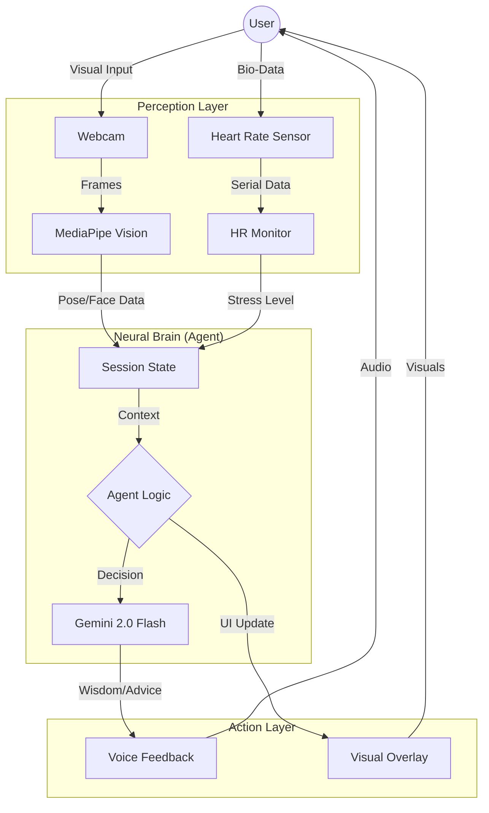

# 🧘 Yoga AI (Web) - AI ChakraFlow

> **Theme: Health and Fitness (Agentic System Track)**
> **The First "Aware" AI Yoga Instructor that Sees, Thinks, and Guides.**

[](https://yogaii.vercel.app/)

**Yoga AI** is not just a pose detector; it is an **Agentic System**. Unlike traditional computer vision apps that simply label what they see, Yoga AI possesses a "Brain" (`Agent Class`) that maintains session state, tracks stress levels via bio-feedback, and uses **Generative AI (Gemini)** to provide context-aware, wisdom-filled guidance—just like a real human teacher.

---

## 🧠 Why is this an "Agentic System"?

A true agent must **Perceive**, **Reason**, and **Act**. Here is how Yoga AI fulfills the "Agentic" criteria:

| Component | Function | Implementation |
| :--- | :--- | :--- |
| **1. Perception (Eyes/Ears)** | Sees Mudras, Posture, Breathing, and reads **Bio-Sensors**. | `MediaPipe` + `MAX30100 Impulse Sensor` |
| **2. Brain (Reasoning)** | Tracks session context ("Warmup" vs "Deep Flow"). Monitors Stress (HRV). Decides **WHEN** to speak. | `YogaAgent` Class + `Gemini 2.0 Flash` |
| **3. Action (Voice/UI)** | Speaks personalized corrections or philosophy. Changes UI/Music based on mood. | `pyttsx3` (TTS) + `PyGame` (Audio) |

> **"It doesn't just buzz when you're wrong; it encourages you when you're right."**

---

## 🌟 Key Features

### 👁️ Advanced Computer Vision
- **Real-time Mudra Detection**: Instantly recognizes sacred hand gestures including **Gyan**, **Surya**, **Prana**, **Namaste**.
- **Posture & Alignment**: Tracks body landmarks to ensure correct yoga forms.

### 🧠 The Neural Agent (New!)
- **State Awareness**: The Agent remembers your "Session Phase". It won't interrupt your flow unless necessary.
- **Stress-Responsive**: High Heart Rate + Poor Posture = **"Relaxation Protocol"** (Agent suggests breathwork).
- **Wisdom Injection**: Uses **Gemini AI** to explain the *spiritual significance* of your current pose, not just the physical alignment.

### 📊 Bio-Analytics Engine
- **Heart & SpO2 Monitoring**: Integrates with hardware sensors to display real-time **Heart Rate (BPM)**.
- **Energy Coherence Radar**: Visualizes the harmony between your mind and body.

---

---

## 🔄 System Architecture

Our solution follows a closed-loop **Agentic Workflow**:



1.  **Observation**: 
    -   *Vision*: "User is holding Gyan Mudra."
    -   *Sensor*: "Heart Rate is 75 BPM (Calm)."
2.  **Reasoning (`agent.py`)**:
    -   *Context*: "User is in Warmup phase."
    -   *Logic*: "Good pose + Calm Heart = Ready for deeper wisdom."
    -   *Decision*: **TRIGGER_EXPLANATION** (Call LLM).
3.  **Action**:
    -   *LLM*: Generates a short, poetic insight about "Focus and Stability."
    -   *TTS*: Speaks the insight to the user.

---

## ⚖️ Ethics, Safety & Limitations

**Constraints & Rules Compliance:**
-   **Open Source**: All libraries used (MediaPipe, OpenCV) are open source.
-   **LLM API**: Uses Google Gemini Free Tier.
-   **Privacy**: All video processing happens **locally**. Images are not uploaded to the cloud (only anonymized text prompts are sent to Gemini).

**Limitations:**
1.  **Medical Advice**: This system is for **wellness and educational purposes only**. It is not a medical device. The "Heart Rate" readings are estimations.
2.  **Environment**: Requires good lighting for accurate computer vision detection.
3.  **Latency**: TTS response time depends on internet connection for the Gemini API.

**Future Improvements:**
-   **Edge AI**: Running the LLM locally (e.g., Gemma 2B) for offline capability.
-   **Multi-User**: Tracking multiple people in a class setting.

---

## 🛠️ Tech Stack

- **Web Interface**: Next.js 15 + Tailwind CSS (Premium Glassmorphic UI)
- **Cortex**: Google Gemini 2.0 Flash (Reasoning)
- **Vision**: MediaPipe (Task-Vision Web)
- **Animations**: Framer Motion
- **Hardware**: Arduino + MAX30100 (Bio-Feedback via Web Serial)

---

## 🚀 Getting Started

### 🌐 Option 1: Premium Web Interface (Highly Recommended)
Experience the futuristic **Neon Dashboard** with glassmorphism and real-time animations.

1.  **Clone & Setup**:
    ```bash
    git clone https://github.com/adityaIITG1/YOGA-AI-IITH-HACATHON.git
    cd yoga-ai-web
    npm install
    ```
2.  **Run Development Server**:
    ```bash
    npm run dev
    ```
3.  **Open Browser**: Visit `http://localhost:3000`. Connect your sensor via the **"Connect"** button (uses Web Serial).

### 🐍 Option 2: Native Python Application
The original robust local environment with real-time OpenCV overlays.

1.  **Navigate to Directory**:
    ```bash
    cd native-python-app
    pip install -r requirements.txt
    ```
2.  **Run**:
    ```bash
    python yogi.py
    ```

---

## 👨‍💻 Submission Highlights

-   **`native-python-app/agent.py`**: The file where the "Reasoning" happens.
-   **`native-python-app/yogi.py`**: The main loop connecting Vision to Brain.
-   **`ai_explainer.py`**: The bridge to the LLM.

---

## 🎥 Video Demonstration

- **YouTube Short**: [Watch Demo](https://youtube.com/shorts/F-6WMswfo4M?si=3ZmhGJcTlJCQPOqC)
